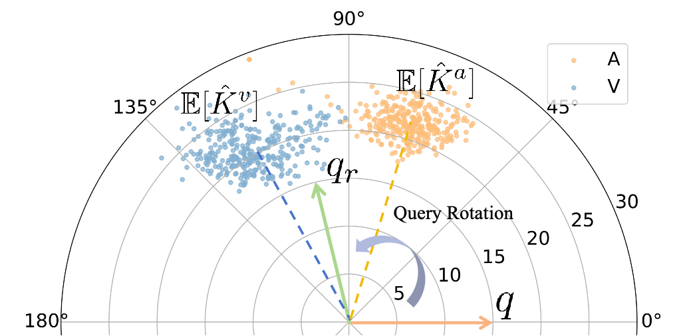

# RollingQ_ICML2025
Official repo for ICML 2025 paper "RollingQ: Reviving the Cooperation Dynamics in Multimodal Transformer" 

Access our paper via \[[arXiv](https://arxiv.org/abs/2506.11465)\].

Authors: [Haotian Ni](https://nihaotian1.github.io/), [Yake Wei](https://echo0409.github.io/), [Hang Liu](https://github.com/Angusliuuu), Gong Chen, Chong Peng, Hao Lin, [Di Hu](https://dtaoo.github.io/). 

In this work, we extend [Imbalance Multimodal Learning](https://github.com/GeWu-Lab/awesome-balanced-multimodal-learning) to dynamic fusion paradigms. We identify the deactivation of dynamic property in attention mechanism and propose a simple yet effective method, _RollingQ_, to revive the cooperation dynamics in multimodal Transformers. 

# Abstract
Multimodal learning faces challenges in effectively fusing information from diverse modalities, especially when modality quality varies across samples. Dynamic fusion strategies, such as attention mechanism in Transformers, aim to address such challenges by adaptively emphasizing modalities based on the characteristics of input data. However, through amounts of carefully designed experiments, we surprisingly observed that the dynamic adaptability of widely-used self-attention models diminishes. Model tends to prefer one modality regardless of data characteristics. This bias triggers a self-reinforcing cycle that _progressively overemphasizes_ the favored modality, widening the distribution gap in attention keys across modalities and deactivating attention mechanism's dynamic properties. To revive adaptability, we propose a simple yet effective method Rolling Query (RollingQ), which balances attention allocation by rotating the query to break the self-reinforcing cycle and mitigate the key distribution gap. Extensive experiments on various multimodal scenarios validate the effectiveness of RollingQ and the restoration of cooperation dynamics is pivotal for enhancing the broader capabilities of widely deployed multimodal Transformers. 

# Overview of RollingQ


# Environment
According to `requirements.txt`, please run the following command in the shell
```bash
conda create -n rollingQ python=3.10
conda activate rollingQ
pip install -r requirements.txt
```

# Datasets
We conducts our experiments on [Kinetic-Sound](https://github.com/cvdfoundation/kinetics-dataset), [CREMA-D](https://github.com/CheyneyComputerScience/CREMA-D) and [CMU-MOSEI](http://multicomp.cs.cmu.edu/resources/cmu-mosei-dataset/). You can download the original datasets, and follow the preprocessing instructions provided in [BalanceBench](https://github.com/GeWu-Lab/BalanceBenchmark). Additionally, the preprocessed data is available on [Huggingface](https://huggingface.co/datasets/WriteMath/BalanceBench).

# Citation
If you find this work useful, please consider citing it.
```
@article{ni2025rollingq,
  title={RollingQ: Reviving the Cooperation Dynamics in Multimodal Transformer},
  author={Ni, Haotian and Wei, Yake and Liu, Hang and Chen, Gong and Peng, Chong and Lin, Hao and Hu, Di},
  journal={arXiv preprint arXiv:2506.11465},
  year={2025}
}
```

# Acknowledgements
This work is supported by National Natural Science Foundation of China (NO.62106272). This work is also supported by Public Computing Cloud, Renmin University of China, and fund for building world-class universities (disciplines) of Renmin University of China.

# Contact
If you have any detailed questions or suggestions, you can email us at: haotian_ni@buaa.edu.cn